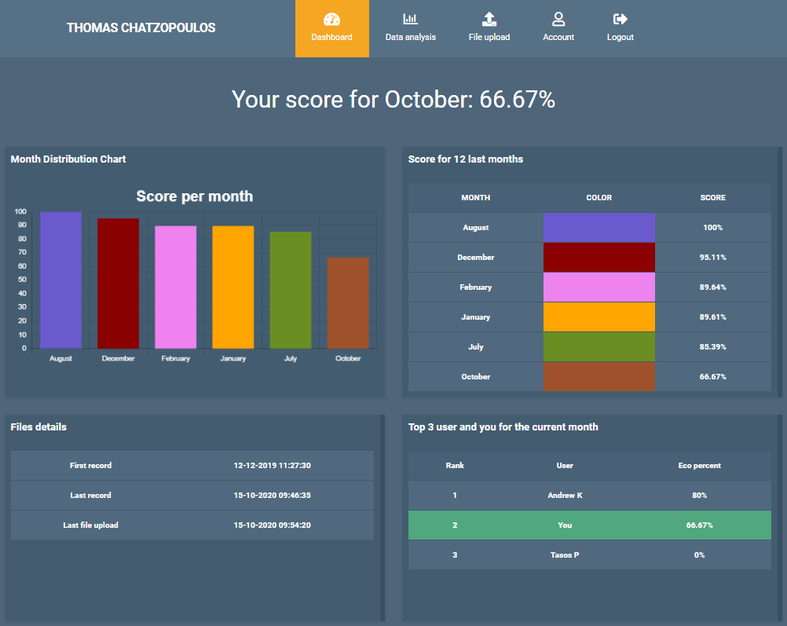

# Location and Activities Crowdsourcing Website

## Website description

This repository contains the code for a Crowdsourcing based Website that analyze and visualize Google's Location History data provided by users. The location and activities data are available from Google at [Google Location History](https://takeout.google.com/). To insert the data to our Website the export type must be JSON.

## Contributors
[Thomas Chatzopoulos](https://github.com/ThomasChatzopoulos)
[Andreas Kallistros](https://github.com/kandrew5)

## Programming Languages and Technologies
* PHP
* JavaScript (AJAX)
* HTML
* CSS
* MySQL
* [JSON stream parser](https://github.com/halaxa/json-machine)
* [Heatmap plug-in](https://leafletjs.com/)
* [Charts plug-in](https://www.chartjs.org/)

## Project preview

Our Website has 2 modules: User and Admin

### Admin

Dashboard that visualizes all the user's data providing information about:
* the activities type distribution
* the distribution of records per month/day/hour/year

Export user data filtered by year/month/day/hour and activity type

### User
Dashboard that visualizes the user's data providing information about:
* the user eco-movement score for the last 12 months
* the period covered by user records and the date of last file upload
* the 3 users with the highest eco-score for the current month in a leaderboard and the position of the user

Upload new JSON file rejecting unwanted locations from the wider area of Patras

